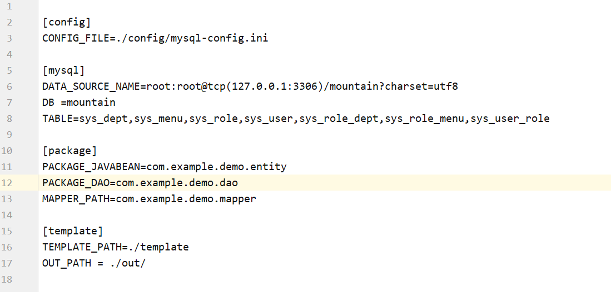
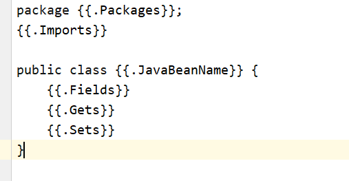
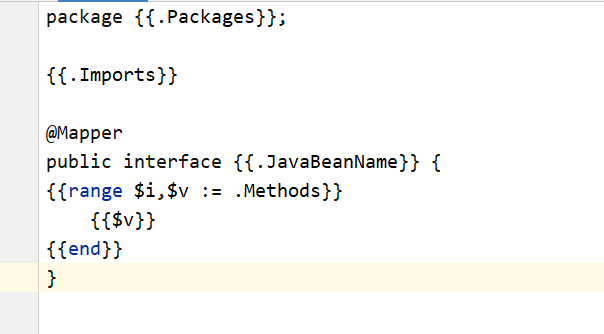
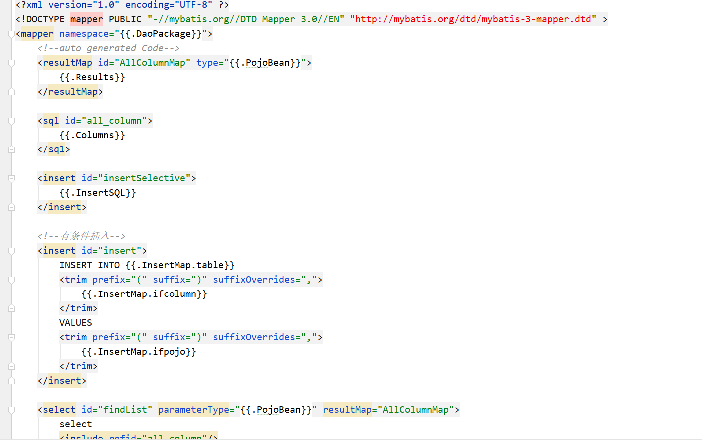
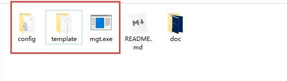
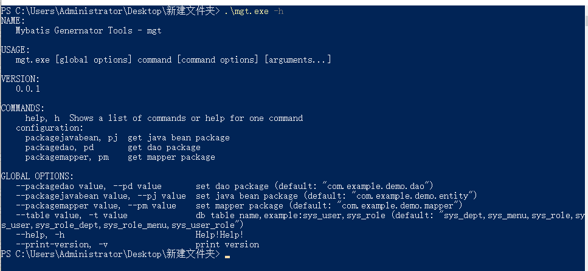
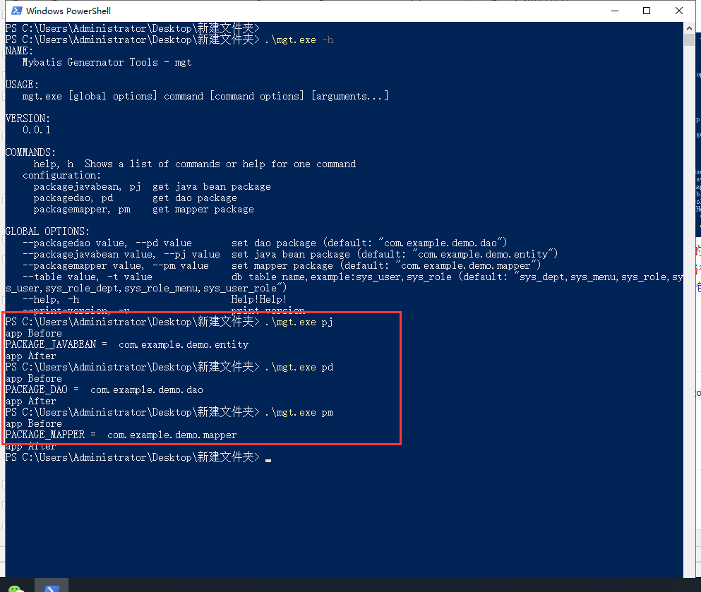
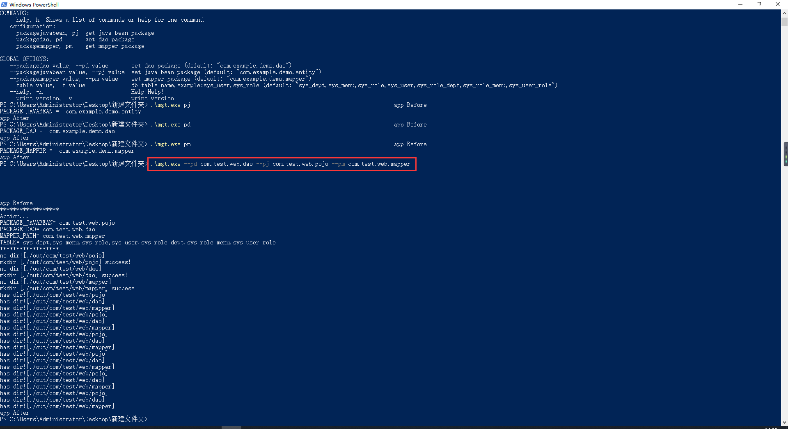

# mybatis-client 

## 介绍
golang 实现的根据数据库表生成对应mybatis的javabean、mapper、Dao层代码文件,
支持命令行客户端形式使用

## 结构
* `config/mysql-config.ini` 配置文件

* `template`下放的是模板文件

## 构建
> 进入工程的src/main 路径下，执行 `go build mgt.go createfile.go`命令
> 在同济目录下会生成一个mgt.exe文件，最终如下图      
>     
> 上图中红框中是必须的文件

## 运行
* 运行 mgt.exe 文件，按照 `config/mysql-config.ini` 配置文件默认生成
* 命令窗口运行：
    * `mgt -h`   帮助   
    
    *   `mgt pj` -- 获取生成javabean文件的包路径  
        `mgt pd` -- 获取生成dao文件的包路径   
        `mgt pm` -- 获取生成mapper文件的包路径  
     
    *   `mgt --pd com.test.web.dao`  -- 生成指定包路径的dao层文件
        `mgt --pj com.test.web.pojo`  -- 生成指定包路径的javabean文件
        `mgt --pm com.test.web.mapper`  -- 生成指定包路径的mapper文件
    
    
## update-log- 2019-07-25
* 新增命令行客户端功能功能 第三方包`gopkg.in/urfave/cli.v1`
* update version 0.0.1

## update-log- 2019-07-22
* 使用`text/template`实现模板功能
* 配置`mysql-config.ini`文件
